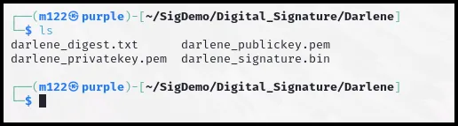
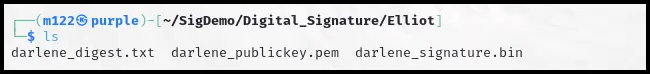
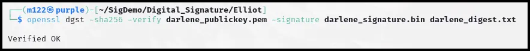
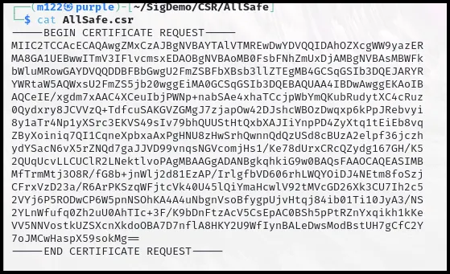
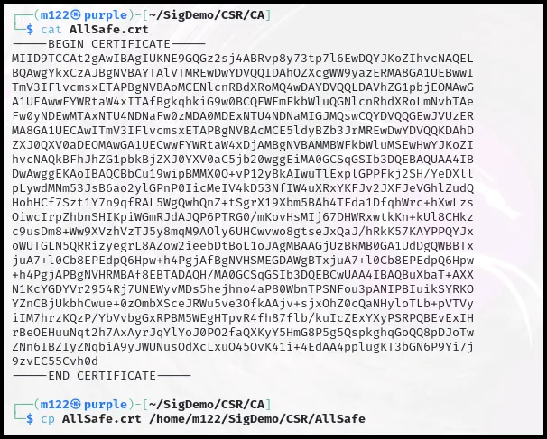

# Digital  Signatures

### Objectives:

- Create a private and public key pair.
- Create a digital signature.
- Receive and verify a digital signature.
- Observe a signature verification failure.
- Create a Certificate Signing Request (CSR).
- Receive and approve a CSR as a Certificate Authority (CA).

### Overview:

A **digital signature** is a cryptographic mechanism used to ensure the **authenticity, integrity, and non-repudiation** of digital messages or documents. It involves the use of a **private key** and a **public key**, which are part of a key pair in public key cryptography.

- The **private key** is used by the signer to generate the digital signature. This key is kept secret by the signer and is used to "sign" a message by creating a unique hash of the message, encrypted with the private key.
- The **public key** is made available to anyone who needs to verify the signature. When someone receives a signed message, they use the sender's public key to decrypt the signature and compare it with the hash of the message. If the two match, the signature is valid, meaning the message hasn’t been altered and was signed by the holder of the corresponding private key.

This process ensures the integrity of the data and verifies the sender's identity.

**OpenSSL** is an open-source toolkit that provides a robust set of cryptographic functions, including encryption, decryption, and secure communication protocols like SSL (Secure Sockets Layer) and TLS (Transport Layer Security). It enables users to perform tasks such as generating cryptographic keys, creating and managing digital certificates, securing web servers via HTTPS, and verifying digital signatures. With its command-line tool and libraries for developers, OpenSSL is widely used for securing network communications, managing certificates, and ensuring data integrity and confidentiality in a variety of applications.

### Task 1 Create a Private and Public Key Pair

```go
mkdir SigDemo && cd SigDemo
```

```go
mkdir Digital_Signature && cd Digital_Signature
```

```go
mkdir Elliot Darlene && cd Darlene
```

```go
openssl genpkey -algorithm RSA -out darlene_privatekey.pem
```

```go
openssl rsa -in darlene_privatekey.pem -out darlene_publickey.pem -pubout -outform PEM
```

This OpenSSL command creates a public key for Darlene, which uses the previously created private key as input. This ensures the mathematical connection between the private and public key pair. The public key that is created is also in a PEM format.

### Task 2 Create a Digital Signature

```go
echo "This is Darlene's digest." > darlene_digest.txt
```

```go
openssl dgst -sha256 -sign darlene_privatekey.pem -out darlene_signature.bin darlene_digest.txt
```

The command hashes the contents of `darlene_digest.txt` using SHA-256, signs that hash with the private key (`darlene_privatekey.pem`), and outputs the signature to `darlene_signature.bin`. This signature can be verified using the corresponding public key to ensure the integrity and authenticity of `darlene_digest.txt`.

```go
ls
```



You can view the folder contents to understand which files have been created so far and determine which files will be sent to Elliot for signature verification.

### Task 3 Receive and Verify a Digital Signature

```go
cp darlene_publickey.pem darlene_signature.bin darlene_digest.txt /home/m122/SigDemo/Digital_Signature/Elliot
```

**Note:** This step simulates sending Elliot the files required to verify Darlene's digital signature: Darlene's public key, the signature file, and the digest.

```go
cd /home/m122/SigDemo/Digital_Signature/Elliot
```

```go
ls
```



**Note:** View the folder contents to ensure the files intended to be sent to Elliot have been received.

```go
openssl dgst -sha256 -verify darlene_publickey.pem -signature darlene_signature.bin darlene_digest.txt

```



This command verifies Darlene's digital signature. Darlene's digital signature is decrypted with her public key to reveal her hash of the digest file. Concurrently, Elliot uses the SHA-256 algorithm (the same as Darlene) to hash the plaintext digest file that Darlene sent. The two resulting hashes are compared, and because they match, "Verified OK" is outputted to the command line, indicating the digital signature has been verified.

### Task 4 Observe a Signature Verification Failure

If the signature were not signed by the signer's actual private key, if there was a change in the signer's message digest, or if the signer's public key was not authentic, the signature verification would fail, alerting the receiver of a potential compromise of the received information.

In this task, you will modify the signer's message digest and observe a signature verification failure.

```go
echo "This is a change to the digest." > darlene_digest.txt
```

```go
openssl dgst -sha256 -verify darlene_publickey.pem -signature darlene_signature.bin darlene_digest.txt
```

As expected, a verification failure occurs when verifying the digital signature with a changed digest.

# **Create and Approve a Certificate Signing Request**

- A **CSR** is a request sent by an entity (e.g., a website or server) to a Certificate Authority (CA) asking for a digital certificate.
- It contains essential information, such as the entity’s public key, domain name, organization details, and other identifying information.
- The CSR is usually signed with the entity's **private key** to prove ownership of the public key included in the request.

**Purpose**: The CSR is used to initiate the process of obtaining a trusted digital certificate that will bind the entity's identity to its public key.

In this exercise, you will create a CSR as AllSafe, and then, as the CA, approve and sign the request, providing a signed certificate back to AllSafe.

### **Task 1 - Create a Certificate Signing Request (CSR)**

The opening steps of obtaining a signed certificate include generating a private and public key pair and then creating and sending a CSR to a Certificate Authority.

In this task, you will create a CSR as the company AllSafe

1. In the Terminal window, **type** the following and **press** Enter:

```go
cd SigDemo
```

1. In the Terminal window, **type** the following and **press** Enter:

```go
mkdir CSR && cd CSR
```

1. In the Terminal window, **type** the following and **press** Enter:

```go
mkdir AllSafe && cd AllSafe
```

1. In the Terminal window, **type** the following. This command generates a new RSA key pair (with a 2048-bit key size), saves the private key to `AllSafe_privatekey.pem`, and creates a Certificate Signing Request (CSR) saved to `AllSafe.csr`. The CSR can be submitted to a Certificate Authority (CA) to request a digital certificate, which will certify that the public key in the CSR belongs to the entity submitting the request.

```go
openssl req -newkey rsa:2048 -keyout AllSafe_privatekey.pem -out AllSafe.csr
```

In the Terminal window, **type** the following for the Enter PEM pass phrase and the Verifying - Enter PEM pass phrase prompts:

```go
AllSafe
```

Note: The pass phrase will not appear when you type.

**Press** Enter.

1. In the Terminal window, **type** the following and **press** Enter:

```go
Country Name: US
```

```go
State or Province Name: New York
```

```go
Locality Name: New York
```

```go
Organization Name: AllSafe
```

```go
Organizational Unit Name: admin
```

```go
Common Name: AllSafe Employee
```

```go
email address: admin@AllSafe.com
```

**Note:** The information entered in this step will be used by the Certificate Authority to conduct a Domain Validation.

1. In the Terminal window, **press** Enter twice on the “extra” certificate attributes.
2. In the Terminal window, **type** the following and **press** Enter:

```go
cat AllSafe.csr
```



**Note:** Notice the certificate signing request is displayed in a base 64 format.

In the Terminal window, **type** the following and **press** Enter:

```go
mkdir /home/m122/SigDemo/CSR/CA && cp AllSafe.csr /home/m122/SigDemo/CSR/CA
```

This step simulates sending the CSR to the Certificate Authority.

### Task 2 - Receive and Approve a CSR as a Certificate Authority (CA)

- The **Certificate Authority (CA)** is a trusted third party responsible for verifying the identity of the entity requesting the certificate.
- Upon receiving the CSR, the CA verifies the authenticity of the information (such as domain ownership or organizational legitimacy).
- Once the CA approves the CSR, it signs the certificate with its **own private key**, creating a **digital certificate** that is trusted by browsers and systems.
- The issued certificate is sent back to the requester and can be installed on servers or other systems.

**Purpose**: By approving the CSR, the CA provides a trusted digital certificate that proves the entity’s identity and ensures secure communication through encryption (e.g., for HTTPS websites). The certificate also enables others to verify that the public key in the certificate genuinely belongs to the requesting entity.

In this task, you will receive and approve a CSR from AllSafe as a Certificate Authority.

1. In the Terminal window, **type** the following and **press** Enter:

```go
cd .. && cd CA
```

1. In the Terminal window, **type** the following and **press** Enter:

```go
openssl genpkey -algorithm RSA -out CA_privatekey.pem
```

**Note:** A Certificate Authority would already have a private key of their own for signing certificates. In this step, we are creating a key for our Certificate Authority.

1. In the Terminal window, **type** the following and **press** Enter:

```go
openssl req -newkey rsa:2048 -nodes -keyout CA_privatekey.pem -x509 -days 1999 -out AllSafe.crt
```

**Note:** Once the Domain Validation is complete, the certificate signing request can be signed. This step signs the certificate signing request with the CA's private key and creates a signed certificate that can be returned to the SecPlusLLC company.

In the Terminal window, **type** the following and **press** Enter:

```go
Country Name: US
State or Province Name: New York 
Locality Name: New York City 
Organization Name: CertAuth 
Organizational Unit Name: admin
Common Name: admin 
email address: admin@certauth.com
```

**Note:** This information about the CA is included in the CA signed certificate.

In the Terminal window, **type** the following and **press** Enter:

```go
cat AllSafe.crt
```

**Note:** The signed certificate is in a base 64 format.

1. In the Terminal window, **type** the following and **press** Enter:

```go
cp AllSafe.crt /home/m122/SigDemo/CSR/AllSafe
```

**Note:** This step simulates the CA sending the signed certificate back to the AllSafe company.

In the Terminal window, **type** the following and **press** Enter:

```go
ls -la /home/m122/SigDemo/CSR/AllSafe
```

This step confirms that the signed certificate (AllSafe.crt) from the CA was received by AllSafe.



These steps are foundational in Public Key Infrastructure (PKI) and digital certificates, which are critical for establishing secure and trusted communications over networks.

### Review

Like many tasks in information technology, there are automated tools available to assist and simplify the process. However, in this lab, all tasks were performed manually using OpenSSL. This approach was chosen to give a thorough understanding of the steps involved in creating digital signatures and approving certificates..

### Summary

You should now be able to:

- Create a private and public key pair.
- Create a digital signature.
- Receive and verify a digital signature.
- Observe a signature verification failure.
- Create a Certificate Signing Request (CSR).
- Receive and approve a CSR as a Certificate Authority (CA).